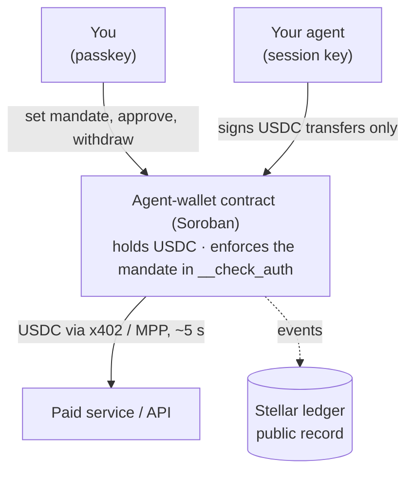
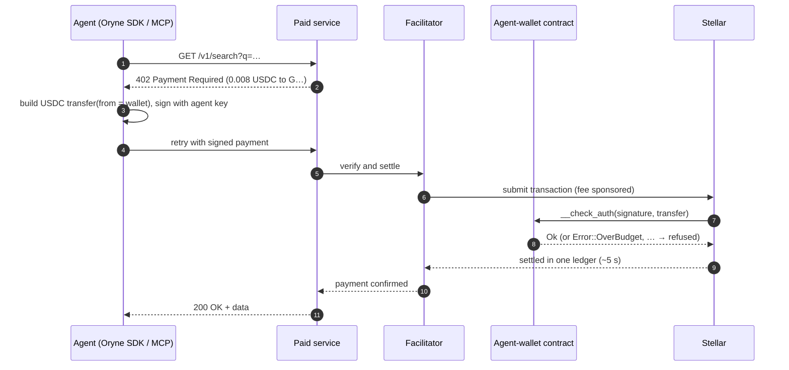
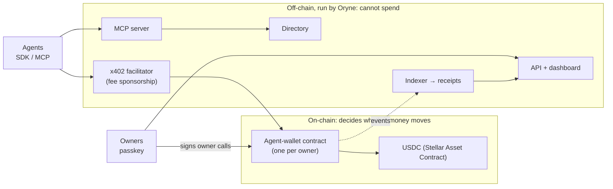

# Oryne

**Wallets for AI agents, with limits they can't break.**

Oryne is the mandate layer for agent payments on [Stellar](https://stellar.org). It gives an AI
agent a wallet it can spend from, and enforces the limits you set (budget, per-payment cap,
allowed services, expiry) in a Soroban smart contract. The limits hold even if the agent is
prompt-injected, its key leaks, or Oryne's own servers are breached.

> **Status: preview.** The website, the dashboard and the developer console in this repo run
> end to end on **simulated data**. The agent-wallet contract in [`contracts/`](contracts) is
> written and unit-tested, but not yet audited or deployed. See
> [What's real today](#whats-real-today).

---

## Contents

- [The problem](#the-problem)
- [How Oryne works](#how-oryne-works)
- [Scenario 1: connecting an agent you already use](#scenario-1-connecting-an-agent-you-already-use)
- [Scenario 2: a developer building an agent product](#scenario-2-a-developer-building-an-agent-product)
- [Scenario 3: getting paid by agents](#scenario-3-getting-paid-by-agents)
- [Architecture](#architecture)
- [Why Stellar](#why-stellar)
- [What's real today](#whats-real-today)
- [Repository layout](#repository-layout)
- [Running it locally](#running-it-locally)
- [Roadmap](#roadmap)

---

## The problem

AI agents are starting to act, not just advise. To finish a task, an agent often has to pay for
something: a search API, a dataset, compute, a ticket. Today there are two bad options:

1. **Give the agent a card or an API key with a balance.** It can spend everything, and a single
   bad prompt or leaked key can drain it.
2. **Use a custodial "agent wallet" service.** The limits live in the provider's database, the
   provider holds the money, and you are trusting their servers.

Oryne takes a third route: **the money stays in a wallet you own, and the limits are code on
Stellar that refuses any payment outside them, whoever asks.**

## How Oryne works

There are three moving parts: **a wallet you own**, **an agent with its own key**, and **a
contract standing between them**.



### The mandate

Each agent gets a policy, stored in your wallet contract:

| Field | Meaning |
|---|---|
| `token` | The one asset the agent may spend (USDC) |
| `per_tx` | Most it can pay in a single payment |
| `budget` / `window_secs` | Most it can pay per window (e.g. 30 days) |
| `payees` | The services it may pay. Empty means any |
| `expires_at` | When its key stops working |

On every payment, the Stellar network calls the wallet's `__check_auth`, which verifies the
agent's signature and checks the transfer against that policy. If anything fails, the
transaction is refused and **nothing moves**:

`UnknownAgent` · `AgentPaused` · `AgentExpired` · `NotATransfer` · `WrongToken` ·
`PayeeNotAllowed` · `OverPerTxLimit` · `OverBudget`

When an agent needs to go beyond its mandate, it **asks you**. Approving signs `approve_once`
with your passkey: a one-time allowance for exactly that payee and amount, used up by the next
matching payment.

### One payment, end to end



---

## Scenario 1: connecting an agent you already use

*You use Claude for research. It keeps hitting paid data and search APIs, and you want it to pay
for them itself, without being able to drain your money.*

| # | You do | In the preview | In the real product |
|---|---|---|---|
| 1 | Land on the site | Home → **"Try to break it"**: drag the amount past $25 and watch the contract refuse it | Same |
| 2 | Click **Connect an agent**, sign in | Any sign-in button works | Sign-up creates a **passkey** (no seed phrase) and deploys **your own agent-wallet contract**, owned by that passkey. Oryne pays the setup fees, so you never need XLM |
| 3 | **Add funds** | Choose USDC on Stellar, bank transfer, mobile money or card | Funds land in *your* contract as USDC, through a Stellar anchor if you paid in local money. Oryne never holds them |
| 4 | **Connect the agent**: name → mandate → connect | $400 a month, $25 per purchase; you get an agent key and a ready Claude/MCP config | A new session key is generated; your passkey signs `add_agent(key, policy)`. The limits now live on Stellar |
| 5 | Paste the config into Claude | — | Claude gets the tools `pay`, `balance`, `find_service`, `request_approval` |
| 6 | The agent works and pays as it goes | **Overview / Activity**: simulated purchases every 15–30 s. Open one to see the receipt: protocol, tx hash, ledger, signer, checks | 402 → signed transfer → contract check → settled in ~5 s |
| 7 | The agent wants something outside its limits | **Approvals**: an $84.50 train ticket over a $60 cap → **Approve once** | Your passkey signs `approve_once` for that payee and amount only |
| 8 | Tighten control | **Services**: untick a service and that agent can't pay it. **Agent page**: expiry, pause, disconnect. **Wallet**: contract, keys, event log | `set_policy`, `set_paused`, `remove_agent`: effective within one ledger |

**What this person gets:** an agent that can spend, with limits even a compromised agent can't
get around, without touching crypto.

## Scenario 2: a developer building an agent product

*You're building "Tripwise", a travel-planning agent with thousands of users. Each user's agent
needs to search flights, check hotels and book trains.*

1. **Developer console** (`/dev`). Install the SDK and create a test key. The sidebar's
   test/live switch maps to Stellar **testnet** and **mainnet**.
2. **Wire up the agent.** One `fetch` that pays:

   ```ts
   import { OryneAgent } from '@oryne/agent'

   const agent = new OryneAgent({ key: userAgentKey })
   // Answers 402 Payment Required from the user's wallet, inside their mandate, then retries.
   const res = await agent.fetch('https://api.skylanefares.example/v1/search?from=NBO&to=LHR')
   ```

   Each Tripwise user has **their own wallet and mandate**, so Tripwise never holds user money.
3. **Try it in the Playground** (`/dev/playground`). Pick an agent, a service and a quantity,
   then click **Send request**. You'll see six steps animate: request → 402 → signed transfer →
   contract check → settlement → 200 OK. Push the quantity over the agent's limit and step 4
   fails with `Error::OverPerTxLimit`. Click **Ask the owner to approve it** and the request
   shows up in the owner's **Approvals**.
4. **Find services** (`/directory`). Agents can also search the directory themselves with
   `find_service`.
5. **Monitor.** The console has Agents, Logs, Usage and **Webhooks**: `payment.settled`,
   `payment.declined`, `approval.requested` and more, so your app can tell the user "your agent
   needs approval for this train".
6. **Contracts** (`/dev/contracts`). Version, wasm hash, deploy commands, the full interface and
   the error codes your app should handle.

Or skip the SDK and use the **MCP server**:

```json
{
  "mcpServers": {
    "oryne": {
      "command": "npx",
      "args": ["@oryne/mcp"],
      "env": { "ORYNE_AGENT_KEY": "oryne_agent_…" }
    }
  }
}
```

## Scenario 3: getting paid by agents

*You run an API and want agents to pay per call, with no accounts, cards or invoices.*

In the console, open **Accept payments** (`/dev/merchant`):

```ts
import express from 'express'
import { paywall } from '@oryne/merchant'

const app = express()
const pay = paywall({ payTo: process.env.STELLAR_ADDRESS, network: 'stellar-testnet' })

app.get('/v1/search', pay('0.008'), search) // 0.008 USDC per call
```

- Unpaid requests get `402 Payment Required`. Paid ones go through once the USDC settles, in
  about 5 seconds.
- Settled payments are final: there are no chargebacks.
- Any x402 client can pay you, not only Oryne agents.
- Turn on **List in the Oryne directory** and agents can find you.

---

## Architecture



**The design rule:** everything that decides whether money moves is on-chain. Everything Oryne
runs off-chain makes the product pleasant to use, but cannot spend a cent.

### Why this is the moat

- **Non-custodial enforcement.** Most agent-payment products are custodial: the limits are a
  row in their database. Oryne's limits are code in a wallet the user owns.
- **Verifiable receipts.** Every payment ties back to an agent key and the mandate that allowed
  it, on a public ledger. That's an audit trail finance teams can rely on.
- **Network effects over time.** Agent identity and reputation, plus a directory of services
  that accept agent payments.
- **Stellar's reach.** Anchors connect wallets to local money in markets where cards are weak.

## Why Stellar

| | |
|---|---|
| **~5 s finality** | Payments are final, not pending |
| **~0.00001 XLM fees** | A $0.001 payment still makes sense |
| **Native USDC** | Issued on Stellar, not bridged |
| **x402 and MPP live** | Open agent-payment protocols already run on Stellar mainnet |
| **Soroban smart accounts** | Custom `__check_auth` makes policy-enforcing wallets possible |
| **Anchors** | Cash in and out in local currency, including mobile money |

---

## What's real today

| Piece | Status |
|---|---|
| Agent-wallet contract ([`contracts/agent-wallet`](contracts/agent-wallet)) | ✅ Written with unit tests for every rule. ⏳ Not yet audited or deployed |
| Website (Home, Product, Network, Directory, Vision) | ✅ Built |
| Owner dashboard (`/app`) | ✅ Works end to end on **simulated** data in the browser |
| Developer console (`/dev`) | ✅ Works end to end on **simulated** data |
| Passkey wallets, backend API, indexer | ⏳ To build |
| `@oryne/agent` SDK, `@oryne/mcp`, `@oryne/merchant` | ⏳ To build. The names and APIs shown are the planned design |
| x402 facilitator with fee sponsorship | ⏳ To build, or use an existing Stellar facilitator |

Addresses, transaction hashes and ledger numbers in the preview are generated to look like
Stellar's. They are **not** on any ledger, and no real money moves.

## Repository layout

```
.
├── contracts/                 Soroban workspace (Rust)
│   └── contracts/agent-wallet/
│       ├── src/lib.rs         The wallet: owner calls + __check_auth mandate enforcement
│       └── src/test.rs        Unit tests for every rule
├── src/
│   ├── pages/                 Public pages: Home, Product, Network, Directory, Vision, Contact
│   ├── sections/              Page sections (home/, vision/)
│   ├── components/            Shared UI, incl. MandateSimulator ("Try to break it")
│   ├── lib/network.ts         Mock Stellar data: services, addresses, live payment feed
│   └── app/                   The dashboard
│       ├── store.tsx          Preview state (localStorage) + the same rules as the contract
│       ├── chain.ts           On-chain identifiers derived for agents, wallets, payments
│       ├── pages/             Owner: Overview, Agents, Approvals, Services, Wallet, Funds, …
│       └── dev/pages/         Developer: Quickstart, Playground, Accept payments, Contracts, …
└── index.html
```

## Running it locally

**Website and dashboard** (Node 20+):

```sh
npm install
npm run dev        # http://localhost:5173
npm run build      # type-check + production build
```

Any sign-in button signs you in as a sample user. Dashboard state lives in your browser's
localStorage; **Settings → Reset sample data** restores it.

**Contract** (Rust + [Stellar CLI](https://developers.stellar.org/docs/tools/cli)):

```sh
cd contracts
cargo test                 # run the unit tests
stellar contract build     # → target/wasm32v1-none/release/agent_wallet.wasm
```

Deploying to testnet is covered in [`contracts/README.md`](contracts/README.md).

## Roadmap

| Stage | Focus | What ships |
|---|---|---|
| **Now** | The wallet | Contract on testnet (open source) · dashboard · MCP server and SDKs · first paid services onboarded by hand |
| **Next** | Mainnet | Audit → mainnet with USDC · merchant kit · facilitator with sponsored fees · passkey wallets · anchor funding and cash-out |
| **Then** | The network | Agent-searchable directory with ranking · team and company policies · verifiable agent identity and reputation · MPP channels |
| **Later** | The economy | Agents paying agents with escrow · credit for agents with a track record · cross-border payouts in local money |

**MVP success metrics** (what we report publicly): agent wallets deployed, USDC volume, payments
settled on Stellar, active agents, and services accepting agent payments.

---

*Oryne is in early development. To join the pilot, talk to us, or list your API, use the
[contact page](https://oryne.org/contact).*
